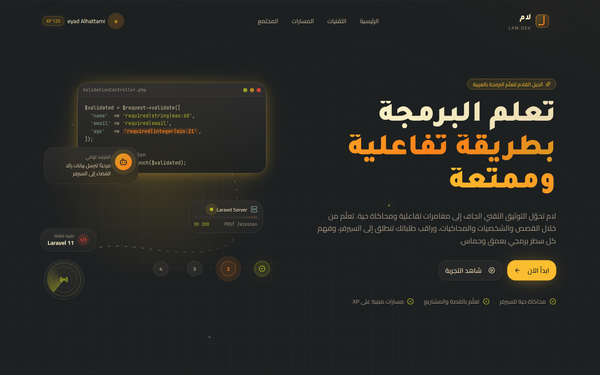
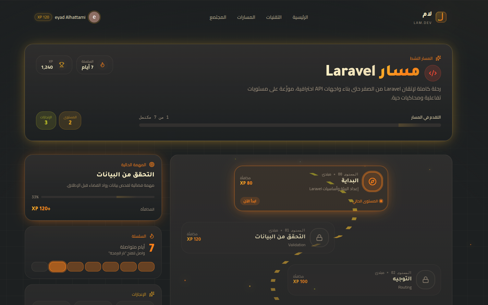
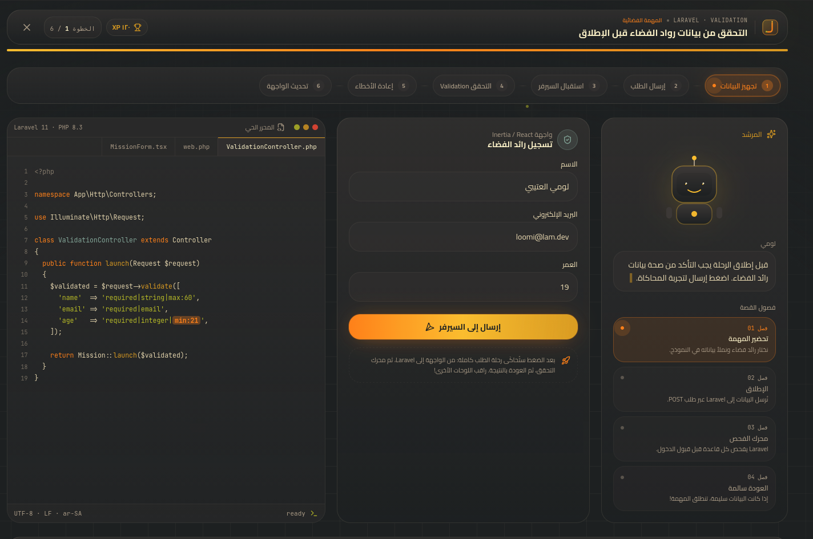
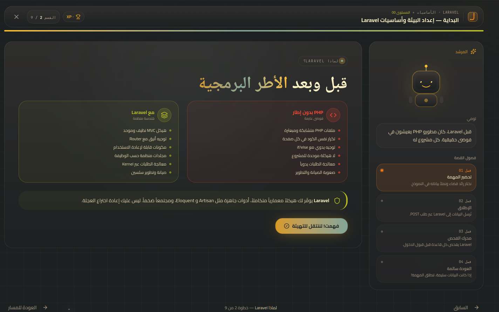

# لام — منصة عربية تفاعلية لتعلم البرمجة 🚀

<div align="center">


### تحويل التوثيق التقني إلى تجربة تعليمية تفاعلية وسينمائية باللغة العربية

[🌐 الموقع الرسمي](https://lam.eyadcs.dev) •
[🖥️ GitHub](https://github.com/eyadcsdev/lam-learning-platform) •
[👨‍💻 المطور](https://eyadcs.dev)

</div>

---

# ✨ ما هو «لام»؟

«لام» ليست منصة كورسات تقليدية.

المشروع يهدف إلى إعادة تصور طريقة تعلم البرمجة عربيًا عبر تحويل التوثيق الرسمي والتقنيات البرمجية إلى:

* 🎮 تجارب تفاعلية
* 🧠 محاكاة هندسية داخلية
* 🌌 دروس سينمائية
* ⚡ Visual Simulations
* 🗺️ خرائط تقدم ومستويات
* 🧩 تعلم بالمهمات والتحديات

بدلًا من مجرد شرح:

> كيف تستخدم Laravel؟

تحاول المنصة الإجابة عن:

* لماذا Laravel موجود؟
* ما المشكلة التي يحلها؟
* كيف يعمل داخليًا؟
* كيف تنتقل الطلبات داخل النظام؟
* كيف يتفاعل الـ Frontend مع الـ Backend؟
* كيف يفكر الإطار البرمجي من الداخل؟

---

# 📸 Screenshots

## 🏠 الصفحة الرئيسية



---

## 🗺️ خريطة التعلم التفاعلية



---

## 🧪 درس Validation التفاعلي



---

## ⚙️ درس إعداد البيئة وأساسيات Laravel



---

# 🚀 المميزات

## 🎮 تجربة تعليمية Gamified

* نظام XP وتقدم
* مستويات ومراحل
* فتح الدروس تدريجيًا
* تتبع الإنجازات
* خريطة تقدم تفاعلية

---

## 🧠 شرح هندسي عميق

كل درس يشرح:

1. لماذا يوجد المفهوم
2. ما المشكلة التي يحلها
3. كيف يعمل داخليًا
4. كيف يتم استخدامه عمليًا

---

## ⚡ محاكاة داخلية لـ Laravel

تشمل:

* Request Lifecycle Visualization
* Validation Flow Simulation
* Interactive Terminal
* Request / Response Flow
* Live Backend Visualization
* Code Highlighting

---

## 🎨 واجهة حديثة وسينمائية

* تصميم مستوحى من:

  * Linear
  * Stripe Docs
  * Vercel
  * Laravel Docs

* Dark Mode بأسلوب Gruvbox

* Animations وMotion Effects

* تجربة عربية RTL كاملة

---

# 🏗️ Architecture

## Backend

* Laravel
* Inertia.js
* SQLite

## Frontend

* React
* TailwindCSS
* Framer Motion
* shadcn/ui
* Lucide Icons

---

# 📚 الدروس الحالية

## Level 00 — البداية

### إعداد البيئة وأساسيات Laravel

يتضمن:

* شرح Laravel
* لماذا frameworks موجودة
* Composer
* Artisan
* Request Lifecycle
* هيكل المشروع
* Interactive Terminal

---

## Level 01 — Validation

درس تفاعلي يحاكي:

* دورة التحقق من البيانات
* حركة الطلبات بين الواجهة والسيرفر
* Laravel Validation Internals
* عرض الأخطاء بشكل حي

ضمن تجربة تعليمية مستوحاة من مهمة فضائية 🚀

---

# 🧩 الرؤية المستقبلية

سيتم إضافة:

* React
* Node.js
* Next.js
* TypeScript
* Docker
* System Design
* AI Engineering
* Algorithms

مع الحفاظ على نفس التجربة التفاعلية.

---

# ⚙️ التشغيل محليًا

## 1️⃣ Clone Repository

```bash
git clone https://github.com/eyadcsdev/lam-learning-platform.git
```

---

## 2️⃣ Install Dependencies

```bash
composer install
npm install
```

---

## 3️⃣ Environment Setup

```bash
cp .env.example .env
php artisan key:generate
```

---

## 4️⃣ Run Database Migrations

```bash
php artisan migrate
```

---

## 5️⃣ Start Development Server

```bash
php artisan serve
npm run dev
```

---

# 🤝 المساهمة

نرحب بالمساهمات لتطوير منصة «لام».

يمكنك المساهمة عبر:

* تحسين الواجهة
* إضافة دروس جديدة
* تحسين الأداء
* إصلاح الأخطاء
* تطوير التجارب التفاعلية
* تحسين الأنيميشن والمحاكاة

## Repository

```bash
https://github.com/eyadcsdev/lam-learning-platform
```

---

# 👨‍💻 المطور

## إياد الحطامي

* 🌐 [https://eyadcs.dev](https://eyadcs.dev)
* 💼 [https://www.linkedin.com/in/eyad-alhattami-93280b409/](https://www.linkedin.com/in/eyad-alhattami-93280b409/)
* 🖥️ [https://github.com/eyadcsdev](https://github.com/eyadcsdev)
* 📘 [https://www.facebook.com/ayad.alhtamy.75529](https://www.facebook.com/ayad.alhtamy.75529)
* 💬 [https://wa.me/+967776680640](https://wa.me/+967776680640)

---

# 🔒 License

This project is licensed under the MIT License.

However:

* اسم «لام»
* الشعار
* الهوية البصرية
* المحتوى التعليمي

تظل حقوقها محفوظة.

---

<div align="center">

### صُنع بشغف لبناء مستقبل أفضل للتعليم التقني العربي ❤️

</div>
